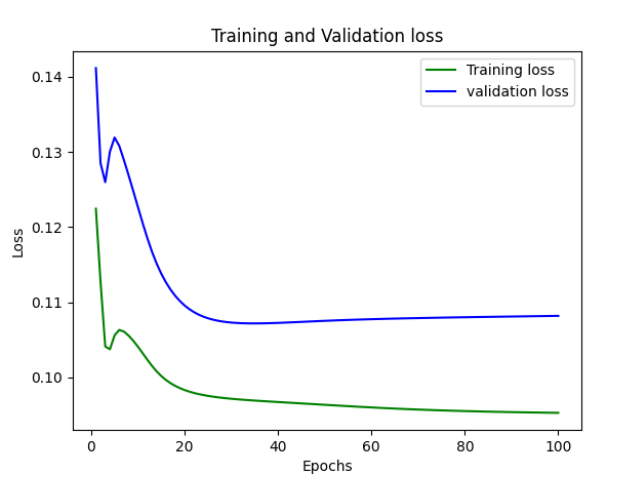

# 🧮 Feedforward Neural Network (FFNN) from Scratch

This project implements a simple Feedforward Neural Network (FFNN) in Python using only NumPy, without relying on deep learning libraries like TensorFlow or PyTorch. It demonstrates how neural networks perform forward propagation, backpropagation, weight updates, and gradient computation from the ground up.

## 📁 Project Structure

```
.
├── Neuron.py               # Defines the Neuron class with activation, error, and gradient
├── Layer.py                # Manages a layer of neurons and their updates
├── Model.py                # Builds, trains, and evaluates the neural network
├── main.py                 # Usage example with training and prediction on sample data
└── lab2.csv                # Example dataset for demonstration (you can replace it)
```

## 🚀 Features

- Custom Neuron and Layer classes
- Forward and backward propagation implemented manually
- Weight updates with momentum (using α)
- RMSE loss function (suitable for regression tasks)
- Training and validation with loss plots
- Bias handling and layer abstraction
- Minimal external dependencies (just `numpy`, `pandas`, and `matplotlib`)

## 📦 Installation

1. Clone the repo:

```bash
git clone https://github.com/alirezakalantarhormozi/FFNNFromScratch.git
cd FFNNFromScratch
```

2. Install dependencies:

```bash
pip install numpy pandas matplotlib
```

## 🛠️ How to Use

The `main.py` script demonstrates how to use the network. It uses an example dataset (`lab2.csv`) for a **regression task**. You can replace this CSV with your own numerical dataset.

```bash
python main.py
```

**Note**:  
- `lab2.csv` should contain numeric features and targets.
- The structure of your CSV should match the slicing logic in `main.py`.
- The current setup trains on the first 25,000 rows and validates on the next 7,000.

## 📉 Loss Curve Example

After training, a plot of training and validation RMSE losses over epochs is displayed:


## ⚙️ Configuration

Inside `Model` initialization:

```python
Model(
  number_of_input=2,
  number_of_output=2,
  list_of_number_of_hidden_layer_neuron=[3],
  number_of_epoch=100,
  eta=0.01,
  alpha=0.9
)
```

- `eta`: Learning rate
- `alpha`: Momentum coefficient
- You can change the number of hidden layers or neurons as needed 

## 🔮 Future Work

- Add support for **classification** tasks by introducing loss functions like cross-entropy
- Add support for different activation functions (e.g., ReLU, tanh)
- Add performance metrics (accuracy, precision, recall)
- Expand modularity and flexibility for more advanced architectures

> ⚠️ Currently, the network supports only **regression tasks** using RMSE loss.

## 📬 Contact

If you have questions or ideas for improvement, feel free to open an issue or contact me.

## 👤 Author
Alireza Kalantarhormozi <br/>
GitHub: @alirezakalantarhormozi
